# MASH Stack Architecture

> Auto-generated architecture document for the MASH protocol reference implementation (`mash-go`).

---

## Table of Contents

1. [Executive Summary](#1-executive-summary)
2. [Protocol Stack Overview](#2-protocol-stack-overview)
3. [Repository Structure](#3-repository-structure)
4. [Component Architecture](#4-component-architecture)
5. [Device Model Hierarchy](#5-device-model-hierarchy)
6. [Wire Protocol](#6-wire-protocol)
7. [Transport Layer](#7-transport-layer)
8. [Discovery & Commissioning](#8-discovery--commissioning)
9. [Service Orchestration](#9-service-orchestration)
10. [Multi-Zone Architecture](#10-multi-zone-architecture)
11. [Certificate Renewal](#11-certificate-renewal)
12. [Feature Catalog](#12-feature-catalog)
13. [State Machines](#13-state-machines)
14. [CLI Tools](#14-cli-tools)
15. [Test Infrastructure](#15-test-infrastructure)
16. [Dependency Graph](#16-dependency-graph)

---

## 1. Executive Summary

MASH (Minimal Application-layer Smart Home Protocol) is a lightweight protocol targeting embedded devices (256KB RAM MCUs). The Go reference implementation provides a complete stack: CBOR wire encoding, TLS 1.3 transport, mDNS discovery, SPAKE2+ commissioning, and a Matter-inspired 4-operation interaction model (Read/Write/Subscribe/Invoke).

**Key metrics:**
- 5 CLI binaries, 23 public packages, 101 test files, 34 YAML conformance test cases
- Go 1.25.5, single module workspace
- Dependencies: fxamacker/cbor, zeroconf, spf13/cobra, x/crypto

---

## 2. Protocol Stack Overview

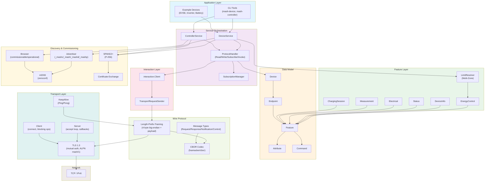
```mermaid
graph TB
    subgraph Application["Application Layer"]
        CLI["CLI Tools<br/>(mash-device, mash-controller)"]
        Examples["Example Devices<br/>(EVSE, Inverter, Battery)"]
    end

    subgraph Service["Service Orchestration"]
        DS["DeviceService"]
        CS["ControllerService"]
        PH["ProtocolHandler<br/>(Read/Write/Subscribe/Invoke)"]
        SM["SubscriptionManager"]
    end

    subgraph Features["Feature Layer"]
        DI["DeviceInfo"]
        ST["Status"]
        EL["Electrical"]
        ME["Measurement"]
        EC["EnergyControl"]
        CH["ChargingSession"]
        LR["LimitResolver<br/>(Multi-Zone)"]
    end

    subgraph Model["Data Model"]
        DEV["Device"]
        EP["Endpoint"]
        FT["Feature"]
        AT["Attribute"]
        CMD["Command"]
    end

    subgraph Interaction["Interaction Layer"]
        IC["interaction.Client"]
        TS["TransportRequestSender"]
    end

    subgraph Wire["Wire Protocol"]
        CBOR["CBOR Codec<br/>(fxamacker/cbor)"]
        MSG["Message Types<br/>(Request/Response/Notification/Control)"]
        FR["Length-Prefix Framing<br/>(4-byte big-endian + payload)"]
    end

    subgraph Transport["Transport Layer"]
        TLS["TLS 1.3<br/>(mutual auth, ALPN mash/1)"]
        SRV["Server<br/>(accept loop, callbacks)"]
        CLT["Client<br/>(connect, blocking ops)"]
        KA["KeepAlive<br/>(Ping/Pong)"]
    end

    subgraph Discovery["Discovery & Commissioning"]
        MDNS["mDNS<br/>(zeroconf)"]
        ADV["Advertiser<br/>(_mashc/_mash/_mashd/_mashp)"]
        BRW["Browser<br/>(commissionable/operational)"]
        PASE["SPAKE2+<br/>(P-256)"]
        CERT["Certificate Exchange"]
    end

    subgraph Network["Network"]
        TCP["TCP / IPv6"]
    end

    CLI --> DS
    CLI --> CS
    Examples --> DS
    DS --> PH
    CS --> PH
    PH --> SM
    PH --> DEV
    DS --> LR
    LR --> EC
    EC --> FT
    DI --> FT
    ST --> FT
    EL --> FT
    ME --> FT
    CH --> FT
    DEV --> EP
    EP --> FT
    FT --> AT
    FT --> CMD
    IC --> TS
    TS --> FR
    PH --> IC
    FR --> CBOR
    MSG --> CBOR
    FR --> TLS
    SRV --> TLS
    CLT --> TLS
    KA --> FR
    TLS --> TCP
    DS --> ADV
    CS --> BRW
    DS --> PASE
    CS --> PASE
    PASE --> CERT
    ADV --> MDNS
    BRW --> MDNS

    style Application fill:#e1f5fe
    style Service fill:#f3e5f5
    style Features fill:#e8f5e9
    style Model fill:#fff3e0
    style Interaction fill:#fce4ec
    style Wire fill:#f1f8e9
    style Transport fill:#e0f2f1
    style Discovery fill:#fff8e1
    style Network fill:#efebe9
```

---

## 3. Repository Structure


```mermaid
graph LR
    subgraph Root["mash/"]
        DOCS["docs/<br/>Protocol specs, features,<br/>decision-log, testing"]
        GOWORK["go.work<br/>(Go 1.25.5)"]
    end

    subgraph MashGo["mash-go/"]
        CMD["cmd/<br/>5 CLI binaries"]
        PKG["pkg/<br/>23 public packages"]
        INT["internal/<br/>testharness"]
        TD["testdata/<br/>34 YAML cases, 10 PICS"]
    end

    subgraph CmdBins["cmd/"]
        MD["mash-device"]
        MC["mash-controller"]
        MT["mash-test"]
        ML["mash-log"]
        MP["mash-pics"]
    end

    subgraph PkgPkgs["pkg/"]
        direction TB
        P_WIRE["wire"]
        P_TRANS["transport"]
        P_DISC["discovery"]
        P_COMM["commissioning"]
        P_SVC["service"]
        P_MODEL["model"]
        P_FEAT["features"]
        P_ZONE["zone"]
        P_INT["interaction"]
        P_SUB["subscription"]
        P_CERT["cert"]
        P_PASE["pase"]
        P_FAIL["failsafe"]
        P_PERS["persistence"]
        P_LOG["log"]
        P_INSP["inspect"]
        P_DUR["duration"]
        P_PICS["pics"]
        P_DEV["device"]
        P_EX["examples"]
        P_CONN["connection"]
    end

    Root --> MashGo
    MashGo --> CMD
    MashGo --> PKG
    MashGo --> INT
    MashGo --> TD
    CMD --> CmdBins
    PKG --> PkgPkgs
```

---

## 4. Component Architecture

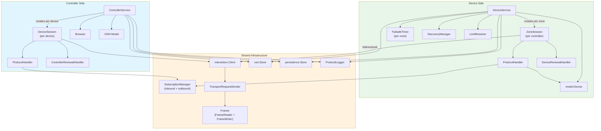
```mermaid
graph TB
    subgraph DeviceSide["Device Side"]
        DSvc["DeviceService"]
        ZS["ZoneSession<br/>(per controller)"]
        DPH["ProtocolHandler"]
        DRen["DeviceRenewalHandler"]
        FST["FailsafeTimer<br/>(per zone)"]
        DM["DiscoveryManager"]
        LR2["LimitResolver"]
        DevModel["model.Device"]
    end

    subgraph ControllerSide["Controller Side"]
        CSvc["ControllerService"]
        DevSes["DeviceSession<br/>(per device)"]
        CPH["ProtocolHandler"]
        CRen["ControllerRenewalHandler"]
        CBrw["Browser"]
        CEM["CEM Model"]
    end

    subgraph Shared["Shared Infrastructure"]
        SubMgr["SubscriptionManager<br/>(inbound + outbound)"]
        IntClient["interaction.Client"]
        TxSender["TransportRequestSender"]
        Framer["Framer<br/>(FrameReader + FrameWriter)"]
        CertStore["cert.Store"]
        StateStore["persistence.Store"]
        PLog["ProtocolLogger"]
    end

    DSvc -->|"creates per zone"| ZS
    ZS --> DPH
    ZS --> DRen
    ZS -->|"bidirectional"| IntClient
    DSvc --> FST
    DSvc --> DM
    DSvc --> LR2
    DSvc --> DevModel
    DPH --> SubMgr
    DPH --> DevModel

    CSvc -->|"creates per device"| DevSes
    DevSes --> CPH
    DevSes --> CRen
    DevSes --> IntClient
    CSvc --> CBrw
    CSvc --> CEM
    CPH --> SubMgr

    IntClient --> TxSender
    TxSender --> Framer
    DSvc --> CertStore
    CSvc --> CertStore
    DSvc --> StateStore
    CSvc --> StateStore
    DSvc --> PLog
    CSvc --> PLog

    style DeviceSide fill:#e8f5e9
    style ControllerSide fill:#e1f5fe
    style Shared fill:#fff3e0
```

---

## 5. Device Model Hierarchy

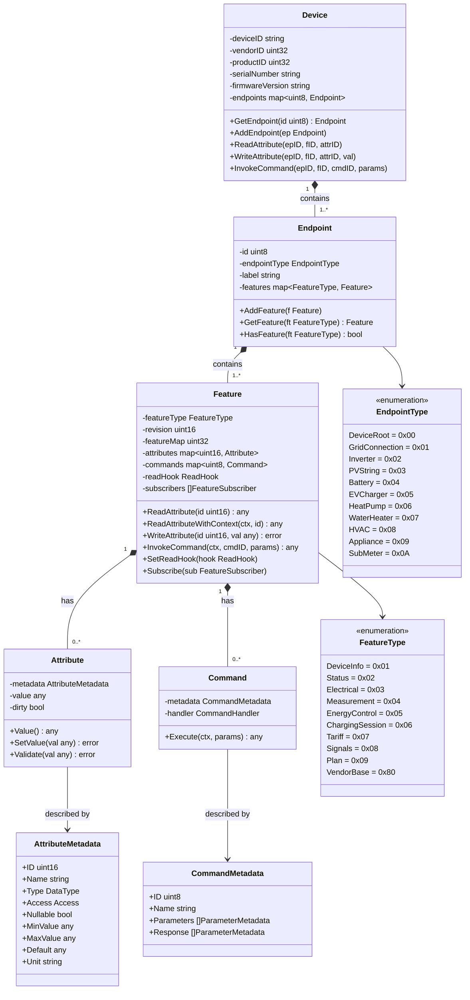
```mermaid
classDiagram
    class Device {
        -deviceID string
        -vendorID uint32
        -productID uint32
        -serialNumber string
        -firmwareVersion string
        -endpoints map~uint8, Endpoint~
        +GetEndpoint(id uint8) Endpoint
        +AddEndpoint(ep Endpoint)
        +ReadAttribute(epID, fID, attrID)
        +WriteAttribute(epID, fID, attrID, val)
        +InvokeCommand(epID, fID, cmdID, params)
    }

    class Endpoint {
        -id uint8
        -endpointType EndpointType
        -label string
        -features map~FeatureType, Feature~
        +AddFeature(f Feature)
        +GetFeature(ft FeatureType) Feature
        +HasFeature(ft FeatureType) bool
    }

    class Feature {
        -featureType FeatureType
        -revision uint16
        -featureMap uint32
        -attributes map~uint16, Attribute~
        -commands map~uint8, Command~
        -readHook ReadHook
        -subscribers []FeatureSubscriber
        +ReadAttribute(id uint16) any
        +ReadAttributeWithContext(ctx, id) any
        +WriteAttribute(id uint16, val any) error
        +InvokeCommand(ctx, cmdID, params) any
        +SetReadHook(hook ReadHook)
        +Subscribe(sub FeatureSubscriber)
    }

    class Attribute {
        -metadata AttributeMetadata
        -value any
        -dirty bool
        +Value() any
        +SetValue(val any) error
        +Validate(val any) error
    }

    class AttributeMetadata {
        +ID uint16
        +Name string
        +Type DataType
        +Access Access
        +Nullable bool
        +MinValue any
        +MaxValue any
        +Default any
        +Unit string
    }

    class Command {
        -metadata CommandMetadata
        -handler CommandHandler
        +Execute(ctx, params) any
    }

    class CommandMetadata {
        +ID uint8
        +Name string
        +Parameters []ParameterMetadata
        +Response []ParameterMetadata
    }

    Device "1" *-- "1..*" Endpoint : contains
    Endpoint "1" *-- "1..*" Feature : contains
    Feature "1" *-- "0..*" Attribute : has
    Feature "1" *-- "0..*" Command : has
    Attribute --> AttributeMetadata : described by
    Command --> CommandMetadata : described by

    class FeatureType {
        <<enumeration>>
        DeviceInfo = 0x01
        Status = 0x02
        Electrical = 0x03
        Measurement = 0x04
        EnergyControl = 0x05
        ChargingSession = 0x06
        Tariff = 0x07
        Signals = 0x08
        Plan = 0x09
        VendorBase = 0x80
    }

    class EndpointType {
        <<enumeration>>
        DeviceRoot = 0x00
        GridConnection = 0x01
        Inverter = 0x02
        PVString = 0x03
        Battery = 0x04
        EVCharger = 0x05
        HeatPump = 0x06
        WaterHeater = 0x07
        HVAC = 0x08
        Appliance = 0x09
        SubMeter = 0x0A
    }

    Feature --> FeatureType
    Endpoint --> EndpointType
```

---

## 6. Wire Protocol

### 6.1 Message Types

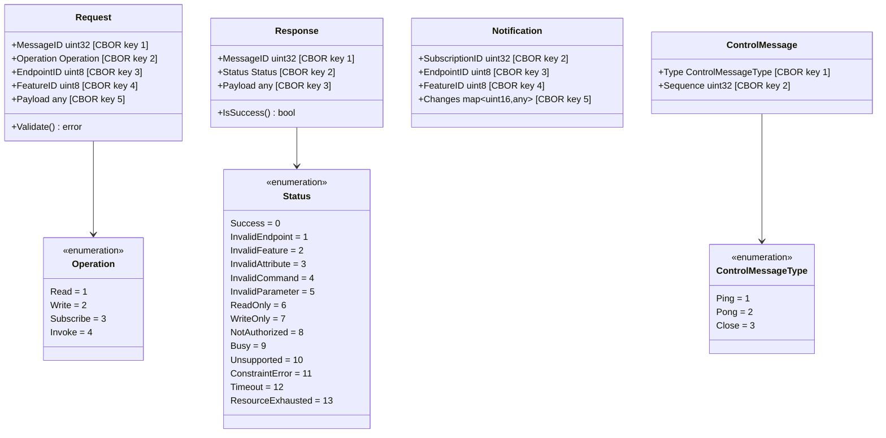
```mermaid
classDiagram
    class Request {
        +MessageID uint32 [CBOR key 1]
        +Operation Operation [CBOR key 2]
        +EndpointID uint8 [CBOR key 3]
        +FeatureID uint8 [CBOR key 4]
        +Payload any [CBOR key 5]
        +Validate() error
    }

    class Response {
        +MessageID uint32 [CBOR key 1]
        +Status Status [CBOR key 2]
        +Payload any [CBOR key 3]
        +IsSuccess() bool
    }

    class Notification {
        +SubscriptionID uint32 [CBOR key 2]
        +EndpointID uint8 [CBOR key 3]
        +FeatureID uint8 [CBOR key 4]
        +Changes map~uint16,any~ [CBOR key 5]
    }

    class ControlMessage {
        +Type ControlMessageType [CBOR key 1]
        +Sequence uint32 [CBOR key 2]
    }

    class Operation {
        <<enumeration>>
        Read = 1
        Write = 2
        Subscribe = 3
        Invoke = 4
    }

    class Status {
        <<enumeration>>
        Success = 0
        InvalidEndpoint = 1
        InvalidFeature = 2
        InvalidAttribute = 3
        InvalidCommand = 4
        InvalidParameter = 5
        ReadOnly = 6
        WriteOnly = 7
        NotAuthorized = 8
        Busy = 9
        Unsupported = 10
        ConstraintError = 11
        Timeout = 12
        ResourceExhausted = 13
    }

    class ControlMessageType {
        <<enumeration>>
        Ping = 1
        Pong = 2
        Close = 3
    }

    Request --> Operation
    Response --> Status
    ControlMessage --> ControlMessageType
```

### 6.2 Frame Format

```
+---+---+---+---+---+---+---+---+---+---+---+
| Length (4B BE) |     CBOR Payload (1-64KB)   |
+---+---+---+---+---+---+---+---+---+---+---+

Example:
  00 00 00 0F  [15 bytes of CBOR data]
```

### 6.3 CBOR Encoding

| Property | Value |
|----------|-------|
| Library | `fxamacker/cbor/v2` |
| Key format | Integer keys (1-5) for compactness |
| Encode sort | `SortCanonical` (deterministic) |
| Decode mode | `DupMapKeyQuiet`, `IndefLengthAllowed` (lenient/forward-compatible) |
| Null semantics | Distinguishes null from absent |
| Timestamps | Unix format |

### 6.4 Message Routing (PeekMessageType)

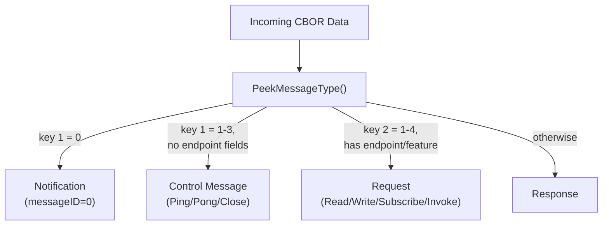
```mermaid
flowchart TD
    DATA["Incoming CBOR Data"] --> PEEK["PeekMessageType()"]
    PEEK -->|"key 1 = 0"| NOTIF["Notification<br/>(messageID=0)"]
    PEEK -->|"key 1 = 1-3,<br/>no endpoint fields"| CTRL["Control Message<br/>(Ping/Pong/Close)"]
    PEEK -->|"key 2 = 1-4,<br/>has endpoint/feature"| REQ["Request<br/>(Read/Write/Subscribe/Invoke)"]
    PEEK -->|"otherwise"| RESP["Response"]
```

---

## 7. Transport Layer

### 7.1 TLS Configuration

| Property | Value |
|----------|-------|
| Version | TLS 1.3 only (no fallback) |
| ALPN | `mash/1` |
| Authentication | Mutual certificate auth (mTLS) |
| Curves | X25519 (preferred), P-256 (mandatory) |
| Cipher suites | Go TLS 1.3 defaults (AES-128-GCM, AES-256-GCM, ChaCha20) |
| Session tickets | Disabled |
| Commissioning mode | `InsecureSkipVerify` (PASE provides security) |

### 7.2 Connection Lifecycle

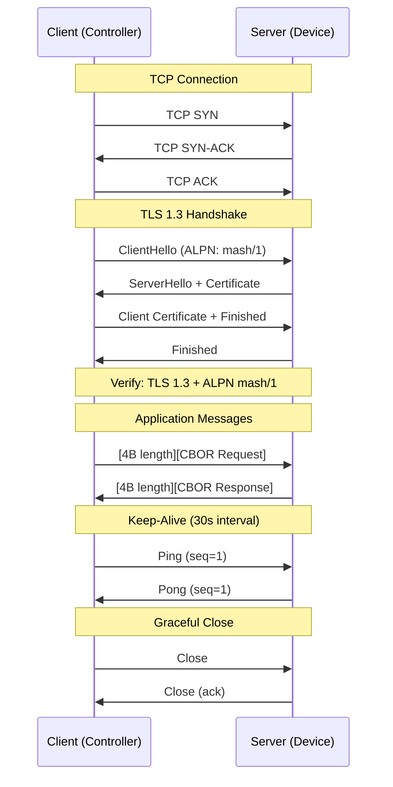
```mermaid
sequenceDiagram
    participant C as Client (Controller)
    participant S as Server (Device)

    Note over C,S: TCP Connection
    C->>S: TCP SYN
    S->>C: TCP SYN-ACK
    C->>S: TCP ACK

    Note over C,S: TLS 1.3 Handshake
    C->>S: ClientHello (ALPN: mash/1)
    S->>C: ServerHello + Certificate
    C->>S: Client Certificate + Finished
    S->>C: Finished
    Note over C,S: Verify: TLS 1.3 + ALPN mash/1

    Note over C,S: Application Messages
    C->>S: [4B length][CBOR Request]
    S->>C: [4B length][CBOR Response]

    Note over C,S: Keep-Alive (30s interval)
    C->>S: Ping (seq=1)
    S->>C: Pong (seq=1)

    Note over C,S: Graceful Close
    C->>S: Close
    S->>C: Close (ack)
```

### 7.3 Keep-Alive Parameters

| Parameter | Default | Description |
|-----------|---------|-------------|
| PingInterval | 30s | Time between pings |
| PongTimeout | 5s | Max wait for pong |
| MaxMissedPongs | 3 | Before connection dead |
| MaxDetectionDelay | 95s | Worst-case dead detection |

### 7.4 Server vs Client Architecture

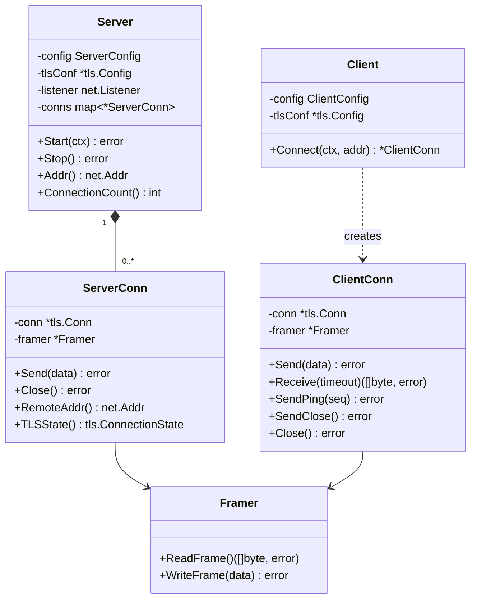
```mermaid
classDiagram
    class Server {
        -config ServerConfig
        -tlsConf *tls.Config
        -listener net.Listener
        -conns map~*ServerConn~
        +Start(ctx) error
        +Stop() error
        +Addr() net.Addr
        +ConnectionCount() int
    }

    class ServerConn {
        -conn *tls.Conn
        -framer *Framer
        +Send(data) error
        +Close() error
        +RemoteAddr() net.Addr
        +TLSState() tls.ConnectionState
    }

    class Client {
        -config ClientConfig
        -tlsConf *tls.Config
        +Connect(ctx, addr) *ClientConn
    }

    class ClientConn {
        -conn *tls.Conn
        -framer *Framer
        +Send(data) error
        +Receive(timeout) ([]byte, error)
        +SendPing(seq) error
        +SendClose() error
        +Close() error
    }

    class Framer {
        +ReadFrame() ([]byte, error)
        +WriteFrame(data) error
    }

    Server "1" *-- "0..*" ServerConn
    Client ..> ClientConn : creates
    ServerConn --> Framer
    ClientConn --> Framer
```

---

## 8. Discovery & Commissioning

### 8.1 mDNS Service Types

| Service Type | DNS-SD Name | Purpose | Instance Name |
|-------------|-------------|---------|---------------|
| Commissionable | `_mashc._udp` | Devices in commissioning mode | `MASH-<discriminator>` |
| Operational | `_mash._tcp` | Commissioned devices | `<ZoneID>-<DeviceID>` |
| Commissioner | `_mashd._udp` | Zone controllers | `<ZoneName>` |
| PairingRequest | `_mashp._udp` | Pairing request signals | `<ZoneID>-<Discriminator>` |

### 8.2 TXT Record Fields

| Key | Service | Description |
|-----|---------|-------------|
| D | Commissionable | Discriminator (0-4095) |
| cat | Commissionable | Device categories (comma-separated) |
| serial | Commissionable | Serial number |
| brand | Commissionable | Vendor name |
| model | Commissionable | Model name |
| DN | All | Device/controller name |
| ZI | Operational, Commissioner | Zone ID (16 hex chars) |
| DI | Operational | Device ID (16 hex chars) |
| VP | Operational, Commissioner | Vendor:Product ID |
| FW | Operational | Firmware version |
| FM | Operational | Feature map hex |
| EP | Operational | Endpoint count |
| ZN | Commissioner | Zone name |
| DC | Commissioner | Device count |

### 8.3 Discovery State Machine

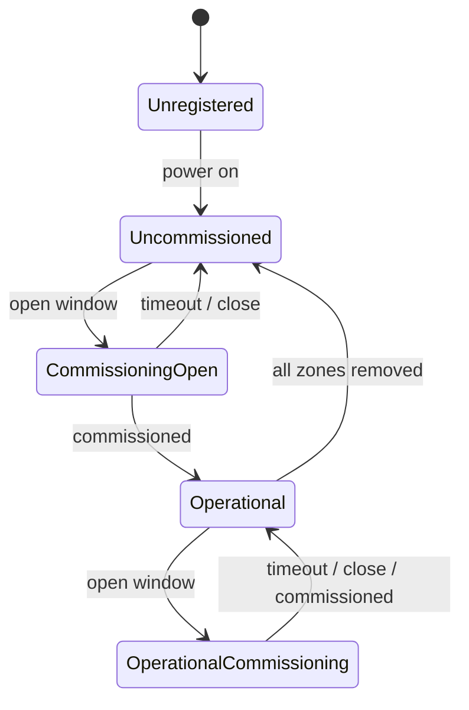
```mermaid
stateDiagram-v2
    [*] --> Unregistered
    Unregistered --> Uncommissioned : power on
    Uncommissioned --> CommissioningOpen : open window
    CommissioningOpen --> Uncommissioned : timeout / close
    CommissioningOpen --> Operational : commissioned
    Operational --> OperationalCommissioning : open window
    OperationalCommissioning --> Operational : timeout / close / commissioned
    Operational --> Uncommissioned : all zones removed
```

### 8.4 Full Commissioning Flow

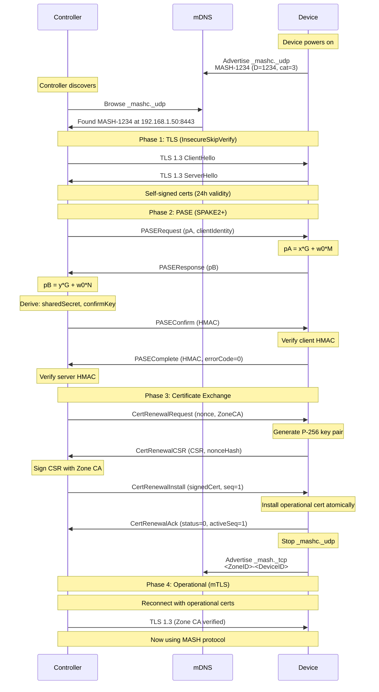
```mermaid
sequenceDiagram
    participant C as Controller
    participant DNS as mDNS
    participant D as Device

    Note over D: Device powers on
    D->>DNS: Advertise _mashc._udp<br/>MASH-1234 (D=1234, cat=3)

    Note over C: Controller discovers
    C->>DNS: Browse _mashc._udp
    DNS->>C: Found MASH-1234 at 192.168.1.50:8443

    Note over C,D: Phase 1: TLS (InsecureSkipVerify)
    C->>D: TLS 1.3 ClientHello
    D->>C: TLS 1.3 ServerHello
    Note over C,D: Self-signed certs (24h validity)

    Note over C,D: Phase 2: PASE (SPAKE2+)
    C->>D: PASERequest (pA, clientIdentity)
    Note over D: pA = x*G + w0*M
    D->>C: PASEResponse (pB)
    Note over C: pB = y*G + w0*N
    Note over C: Derive: sharedSecret, confirmKey
    C->>D: PASEConfirm (HMAC)
    Note over D: Verify client HMAC
    D->>C: PASEComplete (HMAC, errorCode=0)
    Note over C: Verify server HMAC

    Note over C,D: Phase 3: Certificate Exchange
    C->>D: CertRenewalRequest (nonce, ZoneCA)
    Note over D: Generate P-256 key pair
    D->>C: CertRenewalCSR (CSR, nonceHash)
    Note over C: Sign CSR with Zone CA
    C->>D: CertRenewalInstall (signedCert, seq=1)
    Note over D: Install operational cert atomically
    D->>C: CertRenewalAck (status=0, activeSeq=1)

    Note over D: Stop _mashc._udp
    D->>DNS: Advertise _mash._tcp<br/><ZoneID>-<DeviceID>

    Note over C,D: Phase 4: Operational (mTLS)
    Note over C,D: Reconnect with operational certs
    C->>D: TLS 1.3 (Zone CA verified)
    Note over C,D: Now using MASH protocol
```

### 8.5 Identity Derivation

| Identity | Source | Method |
|----------|--------|--------|
| ZoneID | Zone CA certificate | `SHA256(cert.Raw)[0:8]` → 16 hex chars |
| DeviceID | Device public key | `SHA256(PKIX(pubKey))[0:8]` → 16 hex chars |

---

## 9. Service Orchestration

### 9.1 Device Service Lifecycle

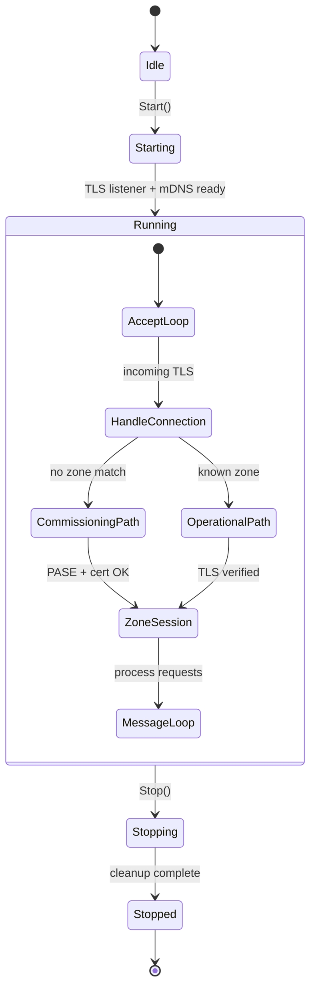
```mermaid
stateDiagram-v2
    [*] --> Idle
    Idle --> Starting : Start()
    Starting --> Running : TLS listener + mDNS ready
    Running --> Stopping : Stop()
    Stopping --> Stopped : cleanup complete
    Stopped --> [*]

    state Running {
        [*] --> AcceptLoop
        AcceptLoop --> HandleConnection : incoming TLS
        HandleConnection --> CommissioningPath : no zone match
        HandleConnection --> OperationalPath : known zone
        CommissioningPath --> ZoneSession : PASE + cert OK
        OperationalPath --> ZoneSession : TLS verified
        ZoneSession --> MessageLoop : process requests
    }
```

### 9.2 Request Dispatch Flow

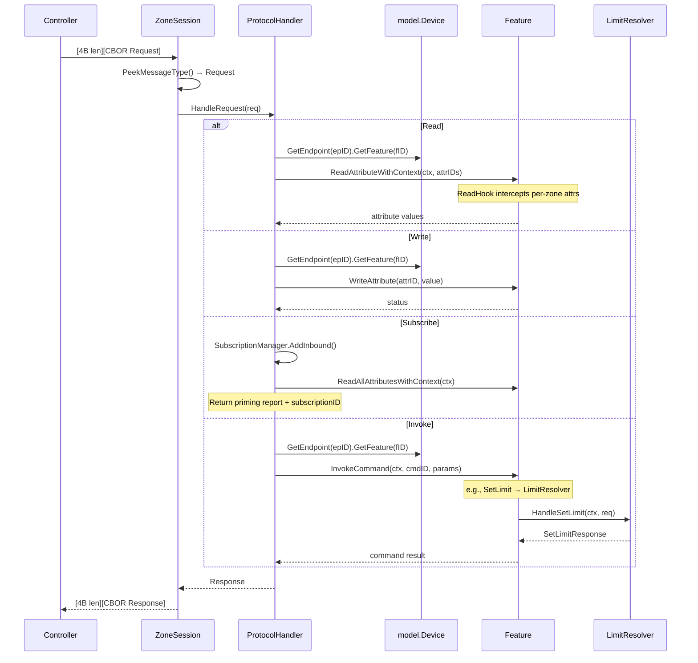
```mermaid
sequenceDiagram
    participant Zone as Controller
    participant ZS as ZoneSession
    participant PH as ProtocolHandler
    participant Dev as model.Device
    participant Feat as Feature
    participant LR as LimitResolver

    Zone->>ZS: [4B len][CBOR Request]
    ZS->>ZS: PeekMessageType() → Request
    ZS->>PH: HandleRequest(req)

    alt Read
        PH->>Dev: GetEndpoint(epID).GetFeature(fID)
        PH->>Feat: ReadAttributeWithContext(ctx, attrIDs)
        Note over Feat: ReadHook intercepts per-zone attrs
        Feat-->>PH: attribute values
    else Write
        PH->>Dev: GetEndpoint(epID).GetFeature(fID)
        PH->>Feat: WriteAttribute(attrID, value)
        Feat-->>PH: status
    else Subscribe
        PH->>PH: SubscriptionManager.AddInbound()
        PH->>Feat: ReadAllAttributesWithContext(ctx)
        Note over PH: Return priming report + subscriptionID
    else Invoke
        PH->>Dev: GetEndpoint(epID).GetFeature(fID)
        PH->>Feat: InvokeCommand(ctx, cmdID, params)
        Note over Feat: e.g., SetLimit → LimitResolver
        Feat->>LR: HandleSetLimit(ctx, req)
        LR-->>Feat: SetLimitResponse
        Feat-->>PH: command result
    end

    PH-->>ZS: Response
    ZS-->>Zone: [4B len][CBOR Response]
```

### 9.3 Notification Flow

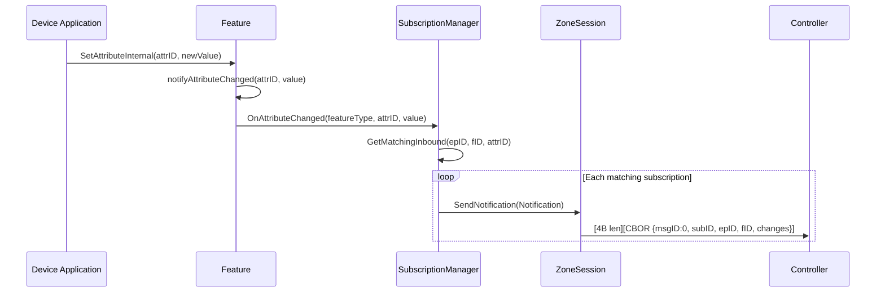
```mermaid
sequenceDiagram
    participant App as Device Application
    participant Feat as Feature
    participant Sub as SubscriptionManager
    participant ZS as ZoneSession
    participant Zone as Controller

    App->>Feat: SetAttributeInternal(attrID, newValue)
    Feat->>Feat: notifyAttributeChanged(attrID, value)
    Feat->>Sub: OnAttributeChanged(featureType, attrID, value)
    Sub->>Sub: GetMatchingInbound(epID, fID, attrID)
    loop Each matching subscription
        Sub->>ZS: SendNotification(Notification)
        ZS->>Zone: [4B len][CBOR {msgID:0, subID, epID, fID, changes}]
    end
```

### 9.4 Event System

| Category | Events |
|----------|--------|
| Connection | `Connected`, `Disconnected` |
| Commissioning | `Commissioned`, `Decommissioned`, `CommissioningOpened`, `CommissioningClosed` |
| Failsafe | `FailsafeStarted`, `FailsafeTriggered`, `FailsafeCleared` |
| Values | `ValueChanged` |
| Discovery | `DeviceDiscovered`, `DeviceGone`, `DeviceRediscovered`, `DeviceReconnected` |
| Renewal | `CertificateRenewed`, `ControllerCertRenewed` |
| Commands | `CommandInvoked` |

---

## 10. Multi-Zone Architecture

### 10.1 Zone Priority & Limit Resolution

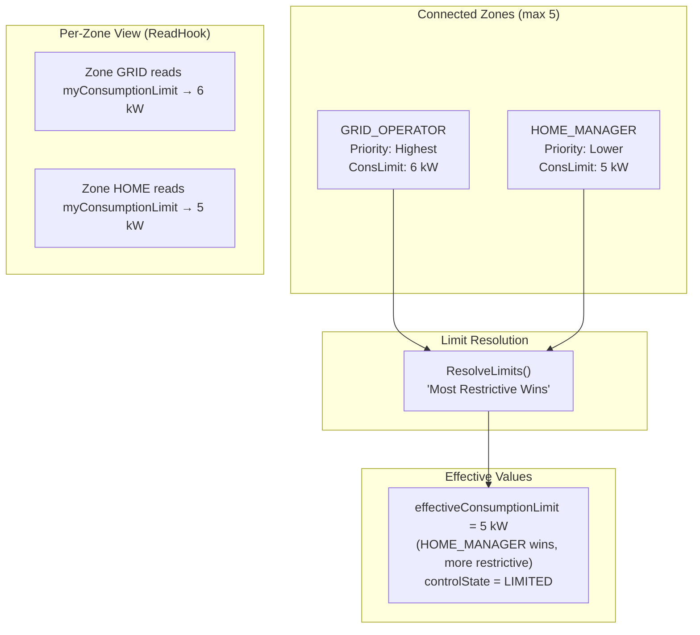
```mermaid
flowchart TD
    subgraph Zones["Connected Zones (max 5)"]
        Z1["GRID_OPERATOR<br/>Priority: Highest<br/>ConsLimit: 6 kW"]
        Z2["HOME_MANAGER<br/>Priority: Lower<br/>ConsLimit: 5 kW"]
    end

    subgraph Resolution["Limit Resolution"]
        RES["ResolveLimits()<br/>'Most Restrictive Wins'"]
    end

    subgraph Result["Effective Values"]
        EFF["effectiveConsumptionLimit = 5 kW<br/>(HOME_MANAGER wins, more restrictive)<br/>controlState = LIMITED"]
    end

    Z1 --> RES
    Z2 --> RES
    RES --> EFF

    subgraph PerZone["Per-Zone View (ReadHook)"]
        MY1["Zone GRID reads myConsumptionLimit → 6 kW"]
        MY2["Zone HOME reads myConsumptionLimit → 5 kW"]
    end
```

### 10.2 Resolution Algorithms

**Limits: Most Restrictive Wins**
- Consumption (positive): smaller value wins (5kW < 6kW)
- Production (negative): closer to zero wins (-3kW > -5kW)
- Mixed signs: consumption takes precedence (safety)

**Setpoints: Highest Priority Wins**
- Zone with lowest priority number wins
- GRID_OPERATOR > BUILDING_MANAGER > HOME_MANAGER > USER_APP

### 10.3 Per-Zone Attribute Pattern

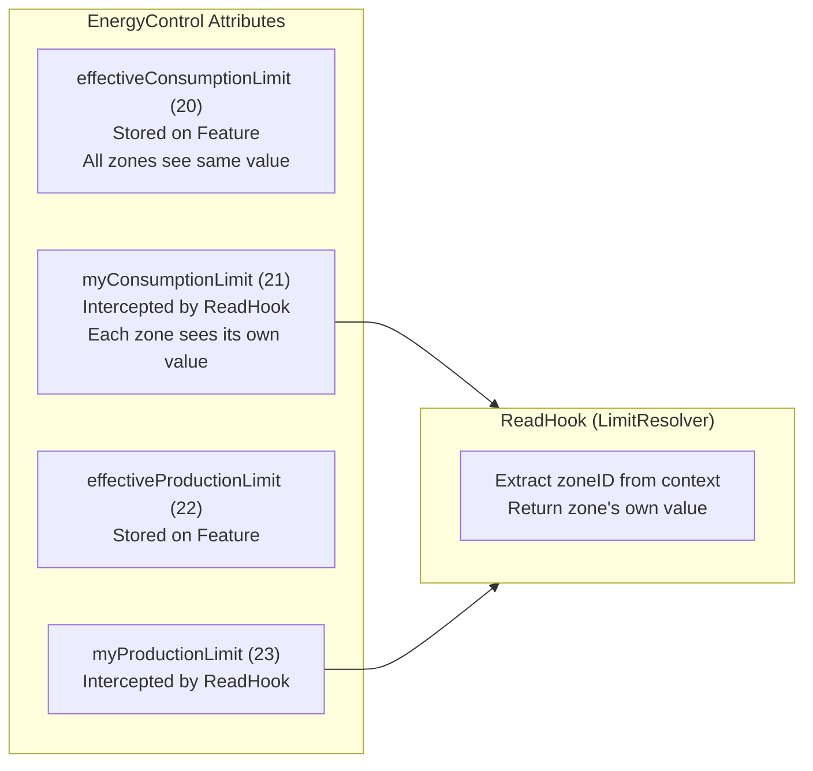
```mermaid
flowchart LR
    subgraph Attributes["EnergyControl Attributes"]
        EFF_C["effectiveConsumptionLimit (20)<br/>Stored on Feature<br/>All zones see same value"]
        MY_C["myConsumptionLimit (21)<br/>Intercepted by ReadHook<br/>Each zone sees its own value"]
        EFF_P["effectiveProductionLimit (22)<br/>Stored on Feature"]
        MY_P["myProductionLimit (23)<br/>Intercepted by ReadHook"]
    end

    subgraph Hook["ReadHook (LimitResolver)"]
        RH["Extract zoneID from context<br/>Return zone's own value"]
    end

    MY_C --> Hook
    MY_P --> Hook
```

### 10.4 Duration Timer Integration

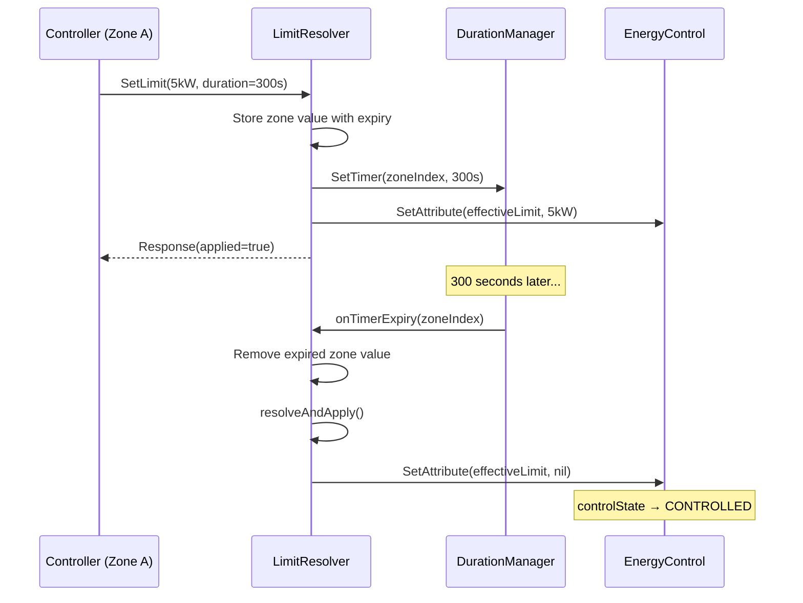
```mermaid
sequenceDiagram
    participant Ctrl as Controller (Zone A)
    participant LR as LimitResolver
    participant DM as DurationManager
    participant EC as EnergyControl

    Ctrl->>LR: SetLimit(5kW, duration=300s)
    LR->>LR: Store zone value with expiry
    LR->>DM: SetTimer(zoneIndex, 300s)
    LR->>EC: SetAttribute(effectiveLimit, 5kW)
    LR-->>Ctrl: Response(applied=true)

    Note over DM: 300 seconds later...
    DM->>LR: onTimerExpiry(zoneIndex)
    LR->>LR: Remove expired zone value
    LR->>LR: resolveAndApply()
    LR->>EC: SetAttribute(effectiveLimit, nil)
    Note over EC: controlState → CONTROLLED
```

---

## 11. Certificate Renewal

### 11.1 In-Session Renewal Flow

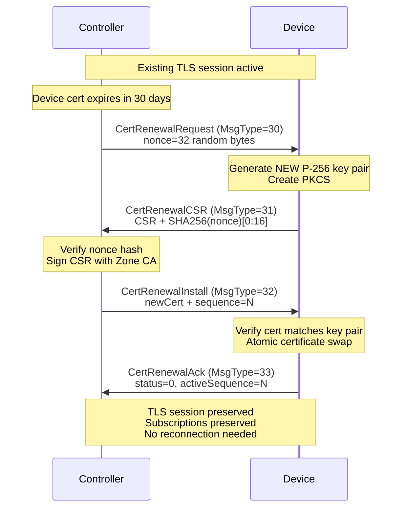
```mermaid
sequenceDiagram
    participant C as Controller
    participant D as Device

    Note over C,D: Existing TLS session active
    Note over C: Device cert expires in 30 days

    C->>D: CertRenewalRequest (MsgType=30)<br/>nonce=32 random bytes
    Note over D: Generate NEW P-256 key pair<br/>Create PKCS#10 CSR
    D->>C: CertRenewalCSR (MsgType=31)<br/>CSR + SHA256(nonce)[0:16]
    Note over C: Verify nonce hash<br/>Sign CSR with Zone CA
    C->>D: CertRenewalInstall (MsgType=32)<br/>newCert + sequence=N
    Note over D: Verify cert matches key pair<br/>Atomic certificate swap
    D->>C: CertRenewalAck (MsgType=33)<br/>status=0, activeSequence=N

    Note over C,D: TLS session preserved<br/>Subscriptions preserved<br/>No reconnection needed
```

### 11.2 Security Properties

| Property | Mechanism |
|----------|-----------|
| Anti-replay | 32-byte nonce per renewal |
| Nonce binding | `SHA256(nonce)[0:16]` in CSR response |
| Key freshness | New key pair generated each renewal |
| Atomicity | Sequence numbers prevent partial installs |
| Timing | Constant-time nonce hash comparison |

---

## 12. Feature Catalog

### 12.1 Feature Overview

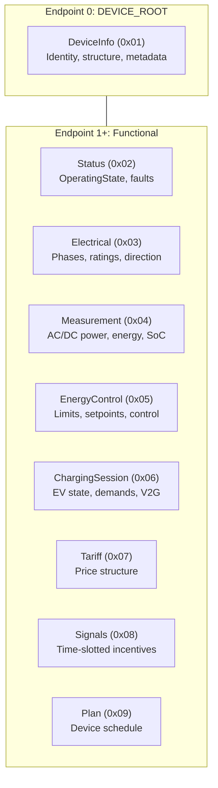
```mermaid
graph TD
    subgraph EP0["Endpoint 0: DEVICE_ROOT"]
        DI2["DeviceInfo (0x01)<br/>Identity, structure, metadata"]
    end

    subgraph EP1["Endpoint 1+: Functional"]
        ST2["Status (0x02)<br/>OperatingState, faults"]
        EL2["Electrical (0x03)<br/>Phases, ratings, direction"]
        ME2["Measurement (0x04)<br/>AC/DC power, energy, SoC"]
        EC2["EnergyControl (0x05)<br/>Limits, setpoints, control"]
        CH2["ChargingSession (0x06)<br/>EV state, demands, V2G"]
        TA["Tariff (0x07)<br/>Price structure"]
        SI["Signals (0x08)<br/>Time-slotted incentives"]
        PL["Plan (0x09)<br/>Device schedule"]
    end

    EP0 --- EP1
```

### 12.2 Feature Map Bits

| Bit | Name | Description |
|-----|------|-------------|
| 0x0001 | Core | Basic energy features (always set) |
| 0x0002 | Flex | Flexible power adjustment |
| 0x0004 | Battery | Battery-specific (SoC, SoH) |
| 0x0008 | EMob | E-Mobility/EVSE |
| 0x0010 | Signals | Incentive signals |
| 0x0020 | Tariff | Tariff data |
| 0x0040 | Plan | Power plan |
| 0x0080 | Process | Process lifecycle |
| 0x0100 | Forecast | Power forecasting |
| 0x0200 | Asymmetric | Per-phase control |
| 0x0400 | V2X | Vehicle-to-grid |

### 12.3 Global Attributes (All Features)

| ID | Name | Type | Description |
|----|------|------|-------------|
| 0xFFFD | clusterRevision | uint16 | Feature implementation version |
| 0xFFFC | featureMap | uint32 | Capability bitmap |
| 0xFFFB | attributeList | array | Supported attribute IDs |
| 0xFFFA | commandList | array | Supported command IDs |

### 12.4 EnergyControl Commands

| ID | Command | Parameters | Purpose |
|----|---------|------------|---------|
| 1 | SetLimit | consumption?, production?, duration?, cause | Set power limit |
| 2 | ClearLimit | direction? | Remove limit |
| 3 | SetCurrentLimits | phases, direction, duration?, cause | Per-phase current limit |
| 4 | ClearCurrentLimits | direction? | Remove current limit |
| 5 | SetSetpoint | consumption?, production?, duration?, cause | Set power target |
| 6 | ClearSetpoint | direction? | Remove setpoint |
| 9 | Pause | duration? | Pause device |
| 10 | Resume | (none) | Resume device |
| 11 | Stop | (none) | Stop device |

### 12.5 Sign Convention

All power/current values use **passive/load convention**:
- **Positive (+)** = Consumption / Charging (power flowing in)
- **Negative (-)** = Production / Discharging (power flowing out)
- Units: milliwatts (mW), milliamps (mA), millivolts (mV)

---

## 13. State Machines

### 13.1 ControlState

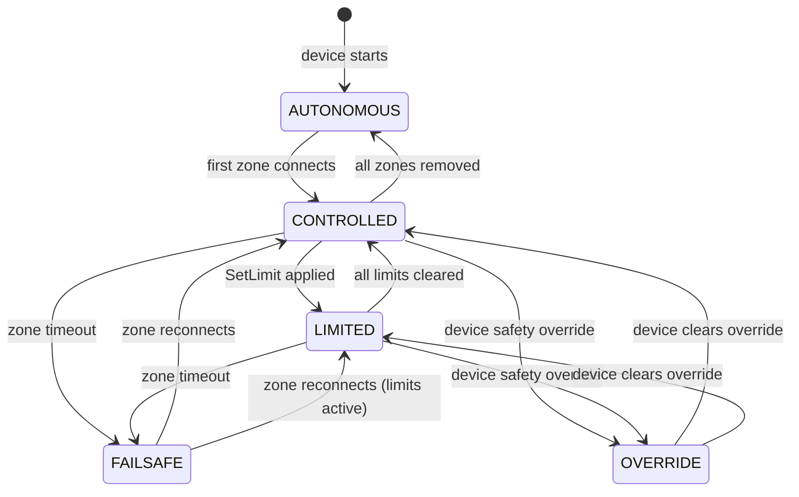
```mermaid
stateDiagram-v2
    [*] --> AUTONOMOUS : device starts
    AUTONOMOUS --> CONTROLLED : first zone connects
    CONTROLLED --> LIMITED : SetLimit applied
    LIMITED --> CONTROLLED : all limits cleared
    CONTROLLED --> FAILSAFE : zone timeout
    LIMITED --> FAILSAFE : zone timeout
    FAILSAFE --> CONTROLLED : zone reconnects
    FAILSAFE --> LIMITED : zone reconnects (limits active)
    CONTROLLED --> OVERRIDE : device safety override
    LIMITED --> OVERRIDE : device safety override
    OVERRIDE --> CONTROLLED : device clears override
    OVERRIDE --> LIMITED : device clears override
    CONTROLLED --> AUTONOMOUS : all zones removed
```

### 13.2 ProcessState (Orthogonal to ControlState)

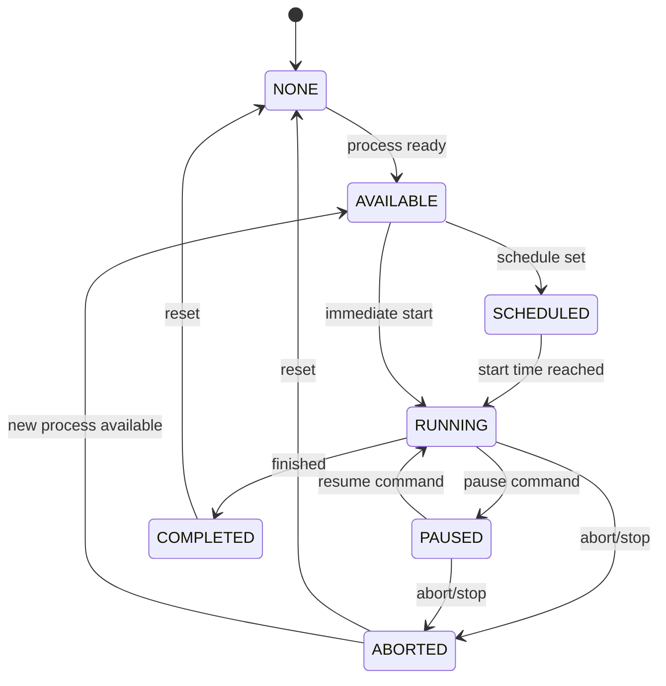
```mermaid
stateDiagram-v2
    [*] --> NONE
    NONE --> AVAILABLE : process ready
    AVAILABLE --> SCHEDULED : schedule set
    SCHEDULED --> RUNNING : start time reached
    AVAILABLE --> RUNNING : immediate start
    RUNNING --> PAUSED : pause command
    PAUSED --> RUNNING : resume command
    RUNNING --> COMPLETED : finished
    RUNNING --> ABORTED : abort/stop
    PAUSED --> ABORTED : abort/stop
    COMPLETED --> NONE : reset
    ABORTED --> NONE : reset
    ABORTED --> AVAILABLE : new process available
```

### 13.3 ChargingState (EV Charger)

```mermaid
stateDiagram-v2
    [*] --> NOT_PLUGGED_IN
    NOT_PLUGGED_IN --> PLUGGED_IN_NO_DEMAND : cable connected
    PLUGGED_IN_NO_DEMAND --> PLUGGED_IN_DEMAND : EV requests charge
    PLUGGED_IN_DEMAND --> PLUGGED_IN_CHARGING : charge starts
    PLUGGED_IN_CHARGING --> PLUGGED_IN_DISCHARGING : V2G active
    PLUGGED_IN_DISCHARGING --> PLUGGED_IN_CHARGING : V2G ends
    PLUGGED_IN_CHARGING --> SESSION_COMPLETE : charge done
    PLUGGED_IN_NO_DEMAND --> SESSION_COMPLETE : session ends
    SESSION_COMPLETE --> NOT_PLUGGED_IN : cable disconnected
    NOT_PLUGGED_IN --> FAULT : error
    PLUGGED_IN_CHARGING --> FAULT : error
    FAULT --> NOT_PLUGGED_IN : cleared
```

### 13.4 OperatingState

```mermaid
stateDiagram-v2
    [*] --> UNKNOWN
    UNKNOWN --> OFFLINE : detected
    UNKNOWN --> STANDBY : detected
    OFFLINE --> STANDBY : comes online
    STANDBY --> STARTING : power on
    STARTING --> RUNNING : initialized
    RUNNING --> PAUSED : temporary halt
    PAUSED --> RUNNING : resume
    RUNNING --> SHUTTING_DOWN : power off
    SHUTTING_DOWN --> OFFLINE : complete
    RUNNING --> FAULT : error
    FAULT --> STANDBY : cleared
    RUNNING --> MAINTENANCE : update/service
    MAINTENANCE --> STANDBY : done
```

### 13.5 Connection State

```mermaid
stateDiagram-v2
    [*] --> Disconnected
    Disconnected --> Connecting : Connect()/Accept()
    Connecting --> Connected : TLS handshake OK
    Connected --> Closing : Close()
    Closing --> Disconnected : graceful close
    Connected --> Disconnected : ForceClose()
    Connecting --> Disconnected : timeout/error
```

---

## 14. CLI Tools

### 14.1 Tool Overview

```mermaid
graph TB
    subgraph Tools["MASH CLI Tools"]
        MD["mash-device<br/>Device simulator"]
        MC["mash-controller<br/>EMS reference"]
        MT["mash-test<br/>Conformance tester"]
        ML["mash-log<br/>Protocol analyzer"]
        MP["mash-pics<br/>PICS validator"]
    end

    subgraph Stack["Shared Stack"]
        SVC["service"]
        FEAT["features"]
        WIRE["wire"]
        TRANS["transport"]
        DISC["discovery"]
        COMM["commissioning"]
    end

    MD --> SVC
    MC --> SVC
    MT --> WIRE
    MT --> TRANS
    MT --> COMM
    ML --> WIRE
    MP -.-> |"standalone"| MP

    style Tools fill:#e1f5fe
    style Stack fill:#f3e5f5
```

### 14.2 mash-device Commands

| Command | Description |
|---------|-------------|
| `inspect [path]` | Inspect device model |
| `read <path>` | Read attribute |
| `write <path> <value>` | Write attribute |
| `zones` | List paired zones |
| `cert [zone-id]` | Show certificates |
| `kick <zone-id>` | Remove zone |
| `commission` | Enter commissioning mode |
| `start` / `stop` | Start/stop simulation |
| `power <kw>` | Set power directly |
| `override <reason>\|clear` | Enter/exit OVERRIDE |
| `contractual <kw>` | Set contractual limits |
| `limit-status` | Show limit state |

### 14.3 mash-controller Commands

| Command | Description |
|---------|-------------|
| `discover` | Discover commissionable devices |
| `devices` | List connected devices |
| `commission <disc> <code>` | Commission device |
| `decommission <id>` | Remove device |
| `inspect [path]` | Inspect model |
| `read <device>/<path>` | Read device attribute |
| `write <device>/<path> <val>` | Write device attribute |
| `limit <device> <kw> [cause] [dur]` | Set power limit |
| `clear <device>` | Clear limit |
| `pause` / `resume` | Control device |
| `capacity <device>` | Show electrical capacity |
| `cert [device]` | Show certificates |
| `renew <device>\|--all\|--status` | Certificate renewal |

---

## 15. Test Infrastructure

### 15.1 Test Architecture

```mermaid
graph TB
    subgraph CLI["mash-test CLI"]
        MAIN["main.go<br/>Flag parsing, runner setup"]
    end

    subgraph Harness["internal/testharness"]
        RUNNER["Runner<br/>TLS connection, PASE,<br/>handler dispatch"]
        ENGINE["Engine<br/>Step execution,<br/>state management"]
        LOADER["Loader<br/>YAML parsing,<br/>PICS filtering"]
        ASSERT["Assertions<br/>15+ helpers"]
        REPORT["Reporter<br/>Text/JSON/JUnit"]
        MOCK["Mock<br/>Device/Controller stubs"]
    end

    subgraph Data["testdata/"]
        CASES["cases/<br/>34 YAML test cases"]
        PICS["pics/<br/>10 PICS files"]
    end

    MAIN --> RUNNER
    RUNNER --> ENGINE
    RUNNER --> LOADER
    ENGINE --> ASSERT
    RUNNER --> REPORT
    LOADER --> CASES
    LOADER --> PICS
    ENGINE --> MOCK

    style CLI fill:#e1f5fe
    style Harness fill:#f3e5f5
    style Data fill:#e8f5e9
```

### 15.2 Test Case YAML Format

```yaml
id: TC-ELEC-001
name: Read Phase Configuration
description: Verifies phase configuration attributes
pics_requirements:
  - MASH.S.ELEC
  - MASH.S.ELEC.A01
preconditions:
  - session_established: true
steps:
  - name: Read phase count
    action: read
    params:
      endpoint: 1
      feature: Electrical
      attribute: phaseCount
    expect:
      read_success: true
      value_in_range: [1, 3]
postconditions:
  - phase_config_readable: true
timeout: "5s"
tags: [electrical, read, basic]
```

### 15.3 PICS Format

```yaml
device:
  vendor: "Example Corp"
  product: "Smart Charger Pro"
items:
  MASH.S: 1
  MASH.S.TRANS.TLS13: true
  MASH.S.ELEC.AC: true
  MASH.S.ELEC.PHASES: 3
  MASH.S.ZONE.MAX: 3
```

### 15.4 Test Execution Flow

```mermaid
sequenceDiagram
    participant CLI as mash-test
    participant L as Loader
    participant R as Runner
    participant E as Engine
    participant D as Target Device

    CLI->>L: LoadDirectory(testdata/cases/)
    L->>L: Parse YAML files
    L->>L: FilterTestCases(PICS)
    L-->>CLI: []TestCase (filtered)

    loop Each TestCase
        CLI->>R: Run(testCase)
        R->>D: TLS Connect
        R->>D: PASE Handshake (if needed)

        loop Each Step
            R->>E: Execute(step, state)
            E->>E: InterpolateParams(step.Params, state)
            E->>D: Protocol action (read/write/invoke)
            D-->>E: Response
            E->>E: CheckExpectations(step.Expect, result)
            E-->>R: StepResult
        end

        R-->>CLI: TestResult
    end

    CLI->>CLI: Reporter.ReportSuite(results)
```

---

## 16. Dependency Graph

### 16.1 Package Dependencies

```mermaid
graph TD
    wire["wire<br/>(CBOR codec, messages)"]
    transport["transport<br/>(TLS, framing, keepalive)"]
    model["model<br/>(Device, Endpoint, Feature)"]
    features["features<br/>(EnergyControl, Status, ...)"]
    zone["zone<br/>(MultiZoneValue, resolution)"]
    discovery["discovery<br/>(mDNS, advertiser, browser)"]
    commissioning["commissioning<br/>(SPAKE2+, messages)"]
    interaction["interaction<br/>(Client)"]
    subscription["subscription<br/>(Manager)"]
    service["service<br/>(DeviceService, ControllerService)"]
    cert["cert<br/>(Store, ZoneCA)"]
    persistence["persistence<br/>(StateStore)"]
    failsafe["failsafe<br/>(Timer)"]
    duration["duration<br/>(Manager)"]
    log_pkg["log<br/>(Logger, FileLogger)"]
    inspect["inspect<br/>(Inspector, Formatter)"]
    pics["pics<br/>(Rules, Validator)"]
    examples["examples<br/>(EVSE, CEM)"]
    pase["pase<br/>(Client, Server sessions)"]

    transport --> wire
    transport --> log_pkg
    interaction --> wire
    interaction --> transport
    features --> model
    features --> zone
    features --> duration
    service --> model
    service --> features
    service --> transport
    service --> wire
    service --> discovery
    service --> commissioning
    service --> interaction
    service --> subscription
    service --> cert
    service --> persistence
    service --> failsafe
    service --> log_pkg
    service --> zone
    examples --> model
    examples --> features
    examples --> service
    commissioning --> wire
    pase --> commissioning
    inspect --> model
    inspect --> features

    style service fill:#f3e5f5,stroke:#9c27b0
    style wire fill:#e8f5e9,stroke:#4caf50
    style transport fill:#e0f2f1,stroke:#009688
    style model fill:#fff3e0,stroke:#ff9800
    style features fill:#e8f5e9,stroke:#4caf50
```

### 16.2 External Dependencies

| Package | Version | Purpose |
|---------|---------|---------|
| `fxamacker/cbor/v2` | v2.9.0 | CBOR encoding/decoding |
| `enbility/zeroconf/v3` | v3.0.0 | mDNS service discovery |
| `golang.org/x/crypto` | v0.47.0 | HKDF, SPAKE2+ helpers |
| `spf13/cobra` | v1.8.1 | CLI framework |
| `stretchr/testify` | v1.11.1 | Test assertions |
| `vektra/mockery/v2` | v2.53.5 | Mock generation |
| `google/uuid` | v1.6.0 | UUID generation |
| `gopkg.in/yaml.v3` | v3.0.1 | YAML parsing |
